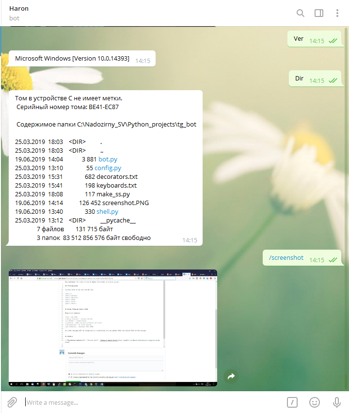

# telegram-remote-shell
Provide remote access via telegram

## Getting Started

These instructions will get you a copy of the project up and running on your local machine for development and testing purposes. See deployment for notes on how to deploy the project on a live system.

### Prerequisites

You must have python and several libs
```
import os
import pyautogui
import subprocess
import telebot
import requests
```

## Using Telegram remote shell

Remote bot commands:
```
/help - get help
/charset [charset] - set/get charset
/cd [folder] - change folder
/screenshot - make and send screenshot of screen
/cmd [command] - run shell command
/get [filename] - download file <50Mb
```
any other message will be recognized as a command and you can upload files via attach files to the message



## Authors

* **Svyatoslav Nadozirny** - *Initial work* - [Telegram Remote Shell](https://github.com/NadozirnySvyatoslav/telegram-remote-shell)


## License

This project is licensed under the MIT License - see the [LICENSE.md](LICENSE.md) file for details
